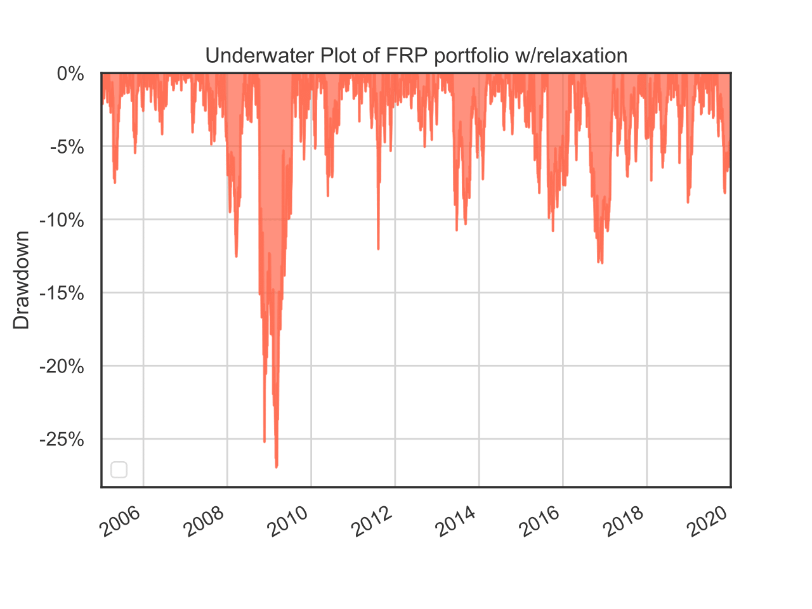

 

  <h1 align="center">Multi-Factor Portfolio Construction</h1>
  

    <h2 align="center">A Risk-Based Approach</h2>
     
  

## About The Repository
 
Repo of the code used while writing my master thesis.

The main objective was to build and backtest a Factor Risk parity Investement strategy.
 
 

## Strategy applied to SP500 equites (2005-2020)
 

Annual Returns            |  Underwater Plot (Drawdown)
:-------------------------:|:-------------------------:
  |  

